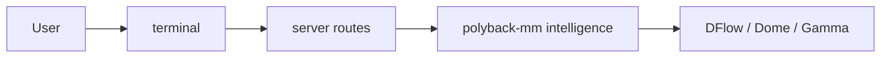

# PredictOS documentation

Central index for setup guides, architecture notes, platform APIs, and polyback-mm operations. The repository root [README](../README.md) remains the primary install and product overview.

## Categories

| Category | Path | Purpose |
|----------|------|---------|
| **Guides** | [guides/](guides/README.md) | Per-feature env vars, flows, and troubleshooting (terminal + intelligence). |
| **Architecture** | [architecture/](architecture/) | Cross-cutting design: storage choices, betting-bot ladder contract. |
| **Platforms** | [platforms/](platforms/) | Venue-specific reference (e.g. Polymarket public APIs). |
| **Operations** | [operations/polyback-mm/](operations/polyback-mm/) | Market-making integration map and risk context for `mm/polyback-mm`. |
| **Assets** | [assets/](assets/) | Shared images for docs or README. |

## Quick links

**Start here**

- [guides/README.md](guides/README.md) — feature guide index and suggested reading order
- [guides/super-intelligence.md](guides/super-intelligence.md) — multi-agent Super Intelligence
- [guides/market-analysis.md](guides/market-analysis.md) — AI Market Analysis tabs (Dome, Polyfactual)

**Trading and data**

- [guides/arbitrage-intelligence.md](guides/arbitrage-intelligence.md) — Polymarket ↔ Kalshi arb
- [guides/betting-bots.md](guides/betting-bots.md) — 15m Up/Down bot (vanilla + ladder)
- [architecture/betting-bot-ladder.md](architecture/betting-bot-ladder.md) — ladder HTTP contract and rung math
- [guides/wallet-tracking.md](guides/wallet-tracking.md) — live Polymarket wallet feed

**Integrations**

- [guides/verifiable-agents.md](guides/verifiable-agents.md) — Irys attestation
- [guides/x402-integration.md](guides/x402-integration.md) — x402 / PayAI

**Backend and analytics**

- [architecture/sqlite-vs-clickhouse.md](architecture/sqlite-vs-clickhouse.md) — when to use SQLite vs ClickHouse
- [operations/polyback-mm/integration.md](operations/polyback-mm/integration.md) — MM code map and terminal config relay
- [operations/polyback-mm/market-making-risks.md](operations/polyback-mm/market-making-risks.md) — adversarial flow and defenses (conceptual)

**Polymarket metadata (no Dome)**

- [platforms/polymarket/gamma-api.md](platforms/polymarket/gamma-api.md) — Gamma / Data / CLOB APIs for rules and context

## Mental model (high level)

For concrete paths and binaries, see the root [README](../README.md).
