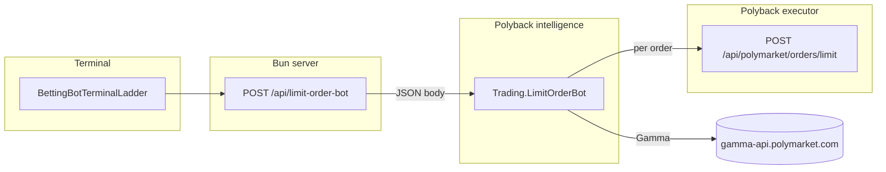

# Architecture: 15m Up/Down **Ladder mode** (terminal ↔ backend)

This document defines how **ladder mode** works for the PredictOS **Betting Bots** terminal (Polymarket 15-minute crypto Up/Down straddles). It aligns the **conceptual strategy**, the **terminal UI** (`BettingBotTerminalLadder`), the **HTTP contract** (`LimitOrderBotRequest` / `LimitOrderBotResponse`), and the **polyback-mm intelligence** executor path.

---

## 1. Concept (product)

**Vanilla:** one straddle — BUY Up and BUY Down at a **single** limit price (e.g. 48¢), with total bankroll split across the two legs.

**Ladder:** multiple straddles at **staggered** probability levels from a **top** price (e.g. 49%) down to a **bottom** (e.g. 35%). Notional is **tapered** — larger allocation at the top rungs (better edge, more frequent fills), smaller at lower rungs (rarer, wider edge if filled). This matches the mental model in the original ladder explainer: *spread exposure across rungs instead of one level*.

---

## 2. System context

- **Terminal** polls every **15 minutes** and sends the same JSON shape for each tick (asset, `sizeUsd`, `ladder`).
- **Bun** proxies to intelligence (`INTELLIGENCE_BASE_URL` … `/api/intelligence/polymarket-up-down-15-markets-limit-order-bot`) or an optional edge URL (`INTELLIGENCE_EDGE_FUNCTION_LIMIT_ORDER_BOT`).
- **Intelligence** resolves the **next** 15m market slug, loads **Up/Down** CLOB token IDs from Gamma, builds **rungs**, then places **limit BUY** orders via the **executor** (paper simulator or, when implemented, live CLOB).

---

## 3. Terminal behavior (reference)

- **Assets:** `BTC` | `ETH` | `SOL` | `XRP` (15m Up/Down family on Polymarket).
- **Controls:** `sizeUsd` = **total bankroll** for the ladder on that market tick; `ladder.maxPrice`, `ladder.minPrice` (integer percents, typically 49→35); `ladder.taperFactor` (e.g. 1.0–2.5).
- **Preview:** `calculateLadderRungs` in `terminal/src/components/BettingBotTerminalLadder.tsx` previews rung count, per-rung USD, and weights. **Backend rung math MUST match this function** so preview and execution never diverge.

---

## 4. HTTP contract (normative)

### 4.1 Request — `POST` body (ladder enabled)

| Field | Type | Meaning |
|--------|------|--------|
| `asset` | string | `BTC` / `ETH` / `SOL` / `XRP` |
| `sizeUsd` | number | **Total** USD allocated across **all** rungs for this market |
| `ladder.enabled` | boolean | Must be `true` for ladder path |
| `ladder.maxPrice` | number? | Top rung percent (e.g. 49) |
| `ladder.minPrice` | number? | Bottom rung percent (e.g. 35) |
| `ladder.taperFactor` | number? | Exponential taper (e.g. 1.5) |

`price` (vanilla) is **ignored** when `ladder.enabled === true`.

### 4.2 Response — ladder success shape

When `success: true` and ladder was used:

- `data.ladderMode`: `true`
- `data.sizeUsd`: same total bankroll as request
- `data.pricePercent`: **convention** — use `ladder.maxPrice` (top rung) for display continuity with vanilla’s single price field
- `data.market.marketSlug`, `targetTimestamp`, `marketStartTime`, optional `marketTitle` — same semantics as vanilla
- `data.market.ordersPlaced`: omit or leave unset in ladder mode (UI uses ladder fields)
- `data.market.ladderOrdersPlaced`: array of `{ pricePercent, sizeUsd, up?, down? }` where `up`/`down` are `{ success, orderId?, errorMsg?, status? }`
- `data.market.ladderTotalOrders`: count of **order attempts** (typically `2 × number of rungs`)
- `data.market.ladderSuccessfulOrders`: count of attempts with `success: true`
- `data.market.error`: optional aggregate message if **both** legs failed on **every** rung or a fatal pre-check failed

---

## 5. Rung construction algorithm (MUST match terminal)

**Inputs:** `totalBankroll`, `maxPrice`, `minPrice`, `taperFactor` (all from request; apply defaults in one place only — recommend duplicating terminal defaults in Go: e.g. max 49, min 35, taper 1.5).

1. **Price levels:** integers from `maxPrice` down to `minPrice` inclusive, step **1** (e.g. 49, 48, …, 35).

2. **Minimum per rung (USD):**  
   `MIN_RUNG_USD = ceil(5 * (maxPrice / 100) * 100) / 100`  
   i.e. USD needed for **5 shares on one side** at the **top** price (conservative vs lower rungs).

3. **Truncate rungs from the bottom:**  
   Start with all levels. While `numRungs > 1`, compute normalized exponential weights  
   `w_i = exp(-taperFactor * i / numRungs)` for `i = 0 … numRungs-1`, normalize to sum 1.  
   If `totalBankroll * w_{numRungs-1} < MIN_RUNG_USD`, drop the **lowest** price level (reduce `numRungs`, keep the slice from max downward). Repeat until the check passes or `numRungs === 1`.

4. **Final rungs:**  
   Recompute weights on the final `numRungs`. For each index `i`:  
   - `allocationPercent_i = 100 * w_i / sum(w)`  
   - `sizeUsd_i = totalBankroll * w_i` (round monetary fields consistently — terminal uses 2 decimal places for display)

**Source of truth for parity:** `calculateLadderRungs` in `BettingBotTerminalLadder.tsx`. Any change there must be ported to `mm/polyback-mm/internal/intelligence/usecase/trading.go` (or shared spec + tests).

---

## 6. Execution semantics (per market tick)

1. **Market selection:** Same as vanilla — slug `"{prefix}-updown-15m-{next}"` where `next = ceil(unix/900)*900` (next 15m boundary).

2. **Token resolution:** Resolve **Up** and **Down** CLOB token IDs from Gamma `outcomes` + `clobTokenIds` (do **not** assume array order).

3. **Per rung:** For rung with price `P` (as fraction `P/100`) and allocated `sizeUsd_rung`:
   - `sharesEach = floor((sizeUsd_rung / 2) / (P/100))` — **half** the rung notional per side (straddle).
   - If `sharesEach < 5`, that rung should be **skipped** with errors recorded on both legs, or the whole request rejected up-front if preview guarantees were violated (prefer **reject at planning** if any rung would be &lt; 5 after rounding).

4. **Order placement:** For each valid rung, sequentially or with bounded concurrency:
   - `POST /api/polymarket/orders/limit` for **Up** token
   - same for **Down** token  
   Same payload shape as vanilla (`tokenId`, `side: BUY`, `price`, `size`, `tickSize`, `negRisk`).

5. **Response assembly:** Build `ladderOrdersPlaced` in **descending price** order (top rung first). Set `ladderTotalOrders` / `ladderSuccessfulOrders`.

---

## 7. Implementation map

| Concern | Location |
|--------|----------|
| Ladder UX, preview, polling | `terminal/src/components/BettingBotTerminalLadder.tsx` |
| Types | `terminal/src/types/betting-bot.ts` |
| Proxy + env | `terminal/src/server/api/limit-order-bot.ts`, `terminal/src/lib/intelligence-url.ts` |
| HTTP route | `mm/polyback-mm/internal/intelligence/httpapi/router.go` → `polymarket-up-down-15-markets-limit-order-bot` |
| Rung math (TS parity) | `mm/polyback-mm/internal/intelligence/usecase/ladder_rungs.go` — `CalculateLadderRungs`; golden tests in `ladder_rungs_test.go` |
| Orchestration | `mm/polyback-mm/internal/intelligence/usecase/trading.go` — `LimitOrderBot`, `limitOrderBotLadder`, `limitOrderBotLoad15mMarket`, `limitOrderBotPostLimitBuy` |
| Limit execution | `mm/polyback-mm/internal/executor/httpapi/handler.go` — paper vs live |

---

## 8. Non-goals / later

- **Live CLOB signing** in executor (same as vanilla; ladder only multiplies order count).
- **Idempotency keys** per market tick (avoid double placement on retries).
- **Extracting rung math** into a shared package or WASM module for guaranteed TS/Go parity.

---

## 9. Quick test matrix

- Bankroll too small for multiple rungs → truncated to one rung or 400 with clear error.
- Market not yet on Gamma → `success: false`, same as vanilla.
- Executor returns 501 (live not wired) → each leg fails with executor message; `ladderSuccessfulOrders` reflects paper/live reality.

This architecture is the contract **BettingBotTerminalLadder** expects; polyback-mm implements **§5–§6** in `ladder_rungs.go` + `LimitOrderBot` and returns **§4.2**.
