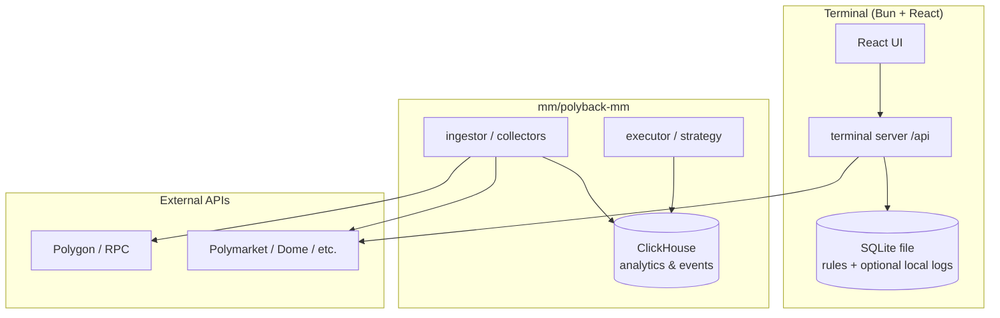

# Storage architecture: SQLite vs ClickHouse

This document assigns **use cases** to **SQLite** or **ClickHouse** in PredictOS, defines **ownership** and **data flows**, and states **anti-patterns**. It matches what already exists in the repo and gives a stable rule for new features.

---

## 1. Principles

| Dimension | **SQLite** | **ClickHouse** |
|-----------|------------|----------------|
| **Workload** | OLTP-style rows, small/medium volume, point lookups, transactional “one writer” semantics | Append-heavy events, time-series, scans and aggregates over large ranges |
| **Deployment** | Single file (or path); no separate server; ideal **co-located** with the app | Server process (e.g. Docker); network clients; tuned for **throughput** |
| **Query style** | Many small reads/writes; constraints; migrations per app | Insert batches; analytical SQL; materialized views; rarely update/delete rows in place |
| **Team boundary** | Natural fit for **terminal** and **local/strat** tooling | Natural fit for **mm/polyback-mm** pipelines and **analytics** |

**Rule of thumb:** If it is *configuration, rules, or low-volume history tied to one developer machine or one terminal instance*, default to **SQLite**. If it is *market/chain/order telemetry at volume or cross-session research analytics*, default to **ClickHouse**.

---

## 2. Use case assignment

### 2.1 SQLite — assigned use cases

| Use case | Rationale | Status in repo |
|----------|-----------|----------------|
| **Alpha / strategy rules DB** | Read-mostly, ships as a file, no daemon | **Implemented:** `strat/alpha-rules/data/alpha_rules.sqlite` via `bun:sqlite` in `terminal/src/server/api/alpha-rules*.ts` |
| **Local workspace / dev config** | Single user, file backup friendly | Optional env paths (same pattern as `ALPHA_RULES_DB`) |
| **Cached API responses (small)** | Bounded size, TTL in table or app logic | Not required initially; prefer HTTP cache headers first |
| **Arbitrage / agent “run log” (per machine)** | Low QPS, JSON blob per run, query by time/id | **Implemented:** `terminal/data/terminal_local.sqlite` (`agent_runs`), env `TERMINAL_LOCAL_DB`; writes from `terminal/src/server/api/arbitrage-finder.ts`; `GET /api/agent-runs` |
| **Feature toggles & secrets index (non-secret metadata)** | Small; actual secrets from env/OS vault | Future only; do not store raw secrets in repo |

### 2.2 ClickHouse — assigned use cases

| Use case | Rationale | Status in repo |
|----------|-----------|----------------|
| **Enriched market & WS data** | High cardinality, time-range analytics | **Implemented:** DDL under `mm/polyback-mm/deploy/clickhouse/init/` (e.g. TOB, enriched streams) |
| **On-chain / Polygon decoding pipelines** | Large append-only facts | **Implemented:** init SQL `008*.sql`, `009*.sql` |
| **Order & executor lifecycle** | Event streams, metrics | **Implemented:** `0091_order_events.sql`, `0092_executor_order_status.sql`, `0098_order_lifecycle_metrics.sql` |
| **Research labels & strategy validation** | Batch analytics, reproducibility | **Implemented:** `007_research_labels.sql`, `0095*.sql`, `0097*.sql` |
| **Cross-market / MM backtest aggregates** | Heavy scans | Fits CH; may read from ingested facts |
| **Terminal agent runs (analytics mirror)** | Time-range stats on arb/agent proxy calls; derived from SQLite | **Implemented:** `polybot.terminal_agent_runs` in [`0099_terminal_agent_runs.sql`](../../mm/polyback-mm/deploy/clickhouse/init/0099_terminal_agent_runs.sql); populated offline via [`export-agent-runs-to-clickhouse.bash`](../../terminal/scripts/export-agent-runs-to-clickhouse.bash) |

### 2.3 Neither (stateless or external service)

| Use case | Where it lives |
|----------|----------------|
| **Edge / serverless handlers** (e.g. Supabase Functions) | **Compute + ephemeral**; persist only if a product requirement says so, then use SQLite or CH per rules above |
| **Authoritative identity** (if added later) | Dedicated auth store or provider — not implied by SQLite/CH choice here |

---

## 3. Architecture (logical)

**Read path:** Terminal talks to HTTP APIs (local or hosted). It **does not** need direct ClickHouse access for core UX; analytics UIs can use a **thin read API** in Go or a small reporting service if you expose CH later.

**Write path:** High-volume facts **never** go to SQLite from hot paths; they land in **ClickHouse** via `polyback-mm` ingestor/executor patterns already in the tree.

---

## 4. Ownership & locations

| Store | Owner | Typical path / config |
|-------|--------|------------------------|
| **SQLite** | Terminal + strat tooling | Alpha rules: `strat/alpha-rules/data/alpha_rules.sqlite` (`ALPHA_RULES_DB`). Run log: `terminal/data/terminal_local.sqlite` (`TERMINAL_LOCAL_DB`). |
| **ClickHouse** | `mm/polyback-mm` | `configs/develop.yaml` → `clickhouse` / `clickhouse_dsn`; compose: `deploy/docker-compose.analytics.yaml` |

New SQLite files should live next to the **owning app** (e.g. under `terminal/data/` or `strat/<module>/data/`) and be **gitignored** if they contain user-generated content.

---

## 5. Anti-patterns

1. **Writing tick-level or sub-second market data to SQLite** — will contend on locks and grow poorly; use ClickHouse (or a bounded in-memory buffer flushing to CH).
2. **Using ClickHouse as the only store for editable user settings** — awkward update semantics; use SQLite or a small KV.
3. **Duplicating the same canonical event in SQLite and CH without a source of truth** — pick one writer path; if you need both, define **ETL** (e.g. nightly) rather than double-write from the UI. The terminal run log follows this: **SQLite is canonical**; ClickHouse is loaded only via the export script (section 8 below).
4. **Storing secrets in SQLite committed to git** — use env, secret manager, or encrypted local store; SQLite is for non-secret or encrypted-at-rest designs only.

---

## 6. Adding a new feature (checklist)

1. **Estimate volume:** &lt; ~1k rows/day per user and point lookups → SQLite first. **High volume or heavy aggregates** → ClickHouse.
2. **Identify writer:** Terminal-only → SQLite in Bun. MM / chain / order stream → CH via `polyback-mm`.
3. **Schema:** SQLite = normal migrations (SQL files or app bootstrap). CH = new file under `deploy/clickhouse/init/` with ordering prefix, plus any ingestor mapping in Go.
4. **API surface:** Prefer **one** service owning writes; expose reads via HTTP if the UI needs it.

---

## 7. Relation to Supabase

Supabase in this repository is primarily **hosted Edge Functions** (HTTP), not a large app database. Replacing or complementing it does **not** automatically choose SQLite vs ClickHouse:

- **Move function hosting** → Bun terminal server or `polyback-mm` HTTP (separate decision).
- **Persist new outcomes** → apply **this document** (SQLite vs CH).

---

## 8. Terminal agent run log → ClickHouse (offline ETL)

**Purpose:** Keep a durable, per-machine history of arbitrage-finder (and future agent) calls in SQLite, and optionally **mirror** into ClickHouse for analytics without dual-writes from the hot path.

| Step | What |
|------|------|
| **Write** | Bun inserts one row per `POST /api/arbitrage-finder` (success or failure), non-blocking. Schema bootstrapped in [`terminal/src/server/local-run-log-db.ts`](../../terminal/src/server/local-run-log-db.ts). |
| **Read (local)** | `GET /api/agent-runs?feature=arbitrage_finder&limit=50` |
| **CH DDL** | [`0099_terminal_agent_runs.sql`](../../mm/polyback-mm/deploy/clickhouse/init/0099_terminal_agent_runs.sql) → `polybot.terminal_agent_runs` |
| **Export** | From repo root or anywhere: `bash terminal/scripts/export-agent-runs-to-clickhouse.bash` — see script header for `CLICKHOUSE_*` and `TERMINAL_LOCAL_DB`. Requires `sqlite3` and `clickhouse-client`. |
| **Idempotency** | Re-export appends duplicates. For a clean reload: `clickhouse-client --query "TRUNCATE TABLE polybot.terminal_agent_runs"` (adjust host/user as needed), then run the script again. |

---

## See also

- ClickHouse DDL: `mm/polyback-mm/deploy/clickhouse/init/`
- SQLite usage: `terminal/src/server/api/alpha-rules.ts`, `terminal/src/server/alpha-rules-db-path.ts`, `terminal/src/server/local-run-log-db.ts`
- MM integration overview: [docs/operations/polyback-mm/integration.md](../operations/polyback-mm/integration.md)
