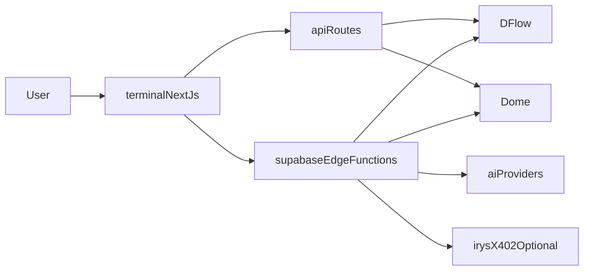

# PredictOS features

This directory contains **setup and architecture guides** for individual PredictOS capabilities: environment variables, data flows, and how each feature fits together. Use it alongside the project [README](../../README.md), which covers installation, repository layout, supported venues, and the full system story.

## What PredictOS is

PredictOS is an open-source framework for running AI-assisted analysis and automated trading workflows on **prediction markets**. You self-host the stack, bring your own API keys and strategies, and connect to major venues including **Kalshi**, **Polymarket**, and **Jupiter** (Kalshi-based events). Market data is typically provided by **DFlow** (Kalshi/Jupiter) and **Dome** (Polymarket); agents and tools plug into **OpenAI**, **xAI Grok**, Polyfactual, optional **Irys** attestation, and **x402 / PayAI** sellers. For philosophy, token economics, and detailed architecture, see the [README](../../README.md).

## Mental model

The [README](../../README.md) documents the concrete `terminal/` and `supabase/` tree and API surface; this diagram is only a high-level path from the UI to external services.

## Feature guides

| Guide | What it covers |
|-------|----------------|
| [super-intelligence.md](super-intelligence.md) | Multi-agent Super Intelligence (supervised and autonomous modes), Bookmaker and Mapper pipeline, environment and execution. |
| [market-analysis.md](market-analysis.md) | Focused setup for **AI Market Analysis**: Kalshi/Polymarket tab and Polyfactual tab, including required env vars. Use [super-intelligence.md](super-intelligence.md) for the full multi-agent architecture; use this guide when you need the dedicated market-analysis configuration reference. |
| [arbitrage-intelligence.md](arbitrage-intelligence.md) | Cross-platform arbitrage between Polymarket and Kalshi (URL in, matching and strategy out). |
| [verifiable-agents.md](verifiable-agents.md) | Storing agent analysis on Irys for verifiable, transparent predictions (devnet and mainnet). |
| [x402-integration.md](x402-integration.md) | x402 protocol and PayAI bazaar: paid tools and data inside Predict Agents. |
| [betting-bots.md](betting-bots.md) | Polymarket 15-minute up/down arbitrage bot (vanilla and ladder modes). |
| [wallet-tracking.md](wallet-tracking.md) | Real-time Polymarket wallet order activity via Dome WebSockets. |

## Suggested reading order

1. **Start with the [README](../../README.md)** — prerequisites, cloning, env files, and where each app (`terminal/`, `supabase/`) lives.
2. **Pick one vertical** aligned with what you want to run first:
   - **Analysis and agents** — [super-intelligence.md](super-intelligence.md); for env details specific to the market analysis UI tabs, also open [market-analysis.md](market-analysis.md).
   - **Cross-venue arb** — [arbitrage-intelligence.md](arbitrage-intelligence.md).
   - **Automation on short-duration markets** — [betting-bots.md](betting-bots.md).
   - **Live wallet surveillance** — [wallet-tracking.md](wallet-tracking.md).
3. **Add optional layers** as needed — [verifiable-agents.md](verifiable-agents.md) for on-chain attestations, [x402-integration.md](x402-integration.md) for paid external tools.

## Related documentation

- [README](../../README.md) — project overview, feature table, architecture, and setup.
- [docs/operation_mm/](../operation_mm/) — market-making and integration notes separate from end-user feature guides.
