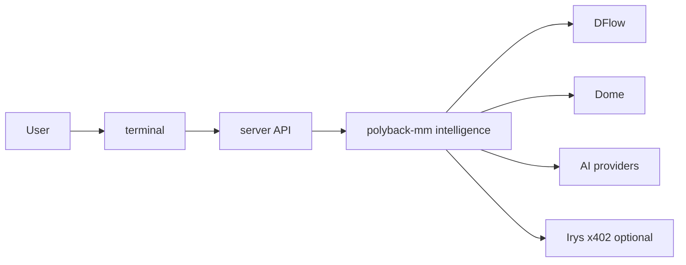

# PredictOS guides

Setup and flow documentation for each **user-facing capability**: environment variables, how data moves, and how features connect. Pair this with the project [README](../../README.md) for installation, repo layout, venues, and the full product story.

## What PredictOS is (one paragraph)

PredictOS is a self-hosted framework for **AI-assisted analysis and automated workflows** on prediction markets. You supply API keys and strategies; the stack talks to venues such as **Kalshi**, **Polymarket**, and **Jupiter** (Kalshi-backed events). Market data usually comes from **DFlow** (Kalshi/Jupiter) and **Dome** (Polymarket). Agents use **OpenAI**, **xAI Grok**, Polyfactual, optional **Irys** attestation, and **x402 / PayAI** sellers. Philosophy and token details stay in the root [README](../../README.md).

## Flow (UI to services)

The root [README](../../README.md) documents the real `terminal/` and `mm/polyback-mm/` tree; this diagram is a coarse path only.

## Guide index

| Guide | What it covers |
|-------|----------------|
| [super-intelligence.md](super-intelligence.md) | Multi-agent Super Intelligence (supervised and autonomous), Bookmaker and Mapper pipeline, env and execution. |
| [market-analysis.md](market-analysis.md) | **AI Market Analysis** UI: Kalshi/Polymarket tab and Polyfactual tab, env vars. Narrower than Super Intelligence; use when configuring those tabs only. |
| [arbitrage-intelligence.md](arbitrage-intelligence.md) | Cross-platform arbitrage: Polymarket vs Kalshi (URL in, matching and strategy out). |
| [verifiable-agents.md](verifiable-agents.md) | Irys-backed, verifiable agent outputs (devnet and mainnet). |
| [x402-integration.md](x402-integration.md) | x402 protocol and PayAI bazaar: paid tools inside Predict Agents. |
| [betting-bots.md](betting-bots.md) | Polymarket 15-minute Up/Down bot (vanilla and ladder). Ladder contract: [../architecture/betting-bot-ladder.md](../architecture/betting-bot-ladder.md). |
| [wallet-tracking.md](wallet-tracking.md) | Real-time Polymarket wallet orders via Dome WebSockets. |

## Suggested reading order

1. **Root [README](../../README.md)** — prerequisites, env files, where `terminal/` and `mm/polyback-mm/` live.
2. **Pick one vertical**
   - **Analysis and agents** — [super-intelligence.md](super-intelligence.md); for Market Analysis tabs only, [market-analysis.md](market-analysis.md).
   - **Cross-venue arb** — [arbitrage-intelligence.md](arbitrage-intelligence.md).
   - **Short-horizon automation** — [betting-bots.md](betting-bots.md).
   - **Live wallet surveillance** — [wallet-tracking.md](wallet-tracking.md).
3. **Optional layers** — [verifiable-agents.md](verifiable-agents.md), [x402-integration.md](x402-integration.md).

## Related docs (outside guides)

- [../architecture/sqlite-vs-clickhouse.md](../architecture/sqlite-vs-clickhouse.md) — SQLite vs ClickHouse boundaries and anti-patterns.
- [../operations/polyback-mm/integration.md](../operations/polyback-mm/integration.md) — polyback-mm market maker wiring and terminal relay.
- [../platforms/polymarket/gamma-api.md](../platforms/polymarket/gamma-api.md) — Polymarket Gamma API for metadata and resolution text.
