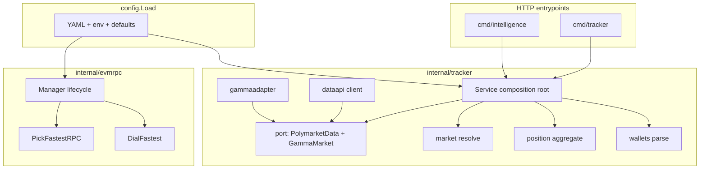

# Polymarket tracker, multi-wallet, and Polygon RPC (comprehensive solution)

This document describes the end-to-end design in **PredictOS / polyback-mm** for:

1. **Position tracking** over public Polymarket APIs (Gamma + data-api), aligned with [polymarket-trade-tracker](https://github.com/leolopez007/polymarket-trade-tracker).
2. **Multiple wallets per request** (no single env-only wallet required).
3. **Resilient Polygon JSON-RPC** using latency probes and failover, in the spirit of [pricefeeding/rpcscan](https://github.com/morpheum-labs/pricefeeding/tree/main/rpcscan), with endpoint lists curated from [ChainList — Polygon](https://chainlist.org/?search=pol).

The implementation follows **SOLID** (ports/adapters, single-purpose packages), **DRY** (one selection algorithm, one config path), and a clear **composition root**.

---

## Architecture (high level)



- **Today (HTTP tracker):** `Service` uses **Gamma** + **data-api** only. No chain client is required for `POST …/polymarket-position-tracker`.
- **Tomorrow (on-chain):** Any feature that needs receipts or contracts (e.g. maker/taker, neg-risk splits) should use **`evmrpc.Manager`** + `Client(ctx)` so RPC instability is handled in one place.

---

## 1. Tracker HTTP service

| Piece | Location | Responsibility |
|--------|-----------|----------------|
| **Ports** | `internal/tracker/port` | `PolymarketData`, `GammaMarket` — **dependency inversion** |
| **Data API** | `internal/tracker/dataapi` | `GET …/positions`, `GET …/activity` |
| **Gamma** | `internal/tracker/gammaadapter` | Wraps shared `gamma.Client` |
| **Market** | `internal/tracker/market` | Slug → `conditionId` + YES/NO CLOB token ids; sentinel errors |
| **Position** | `internal/tracker/position` | Pure math + JSON shape for the terminal |
| **Wallets** | `internal/tracker/wallets.go` | `address` / `user` / `wallet`, `addresses` / `wallets`, env fallback |
| **HTTP** | `internal/tracker/httpapi` | Routes + CORS |
| **Root** | `internal/tracker` (`Service`) | Orchestration + response mapping |

**Processes:** `cmd/tracker` (default `:8086`), or `cmd/intelligence` (delegates to the same `Service`).

**API:** See [mm/polyback-mm/docs/API.md](../../mm/polyback-mm/docs/API.md) (Tracker + Intelligence sections).

---

## 2. Multi-wallet contract

- **Single wallet:** `data: { asset, walletAddress, position }`.
- **Batch:** `data: { asset, wallets: [ { address, success, position \| error } ] }`.
- **Body fields:** `address` \| `user` \| `wallet`; or `addresses` \| `wallets` (arrays). Max **32** per request.
- **Legacy default:** `POLYMARKET_PROXY_WALLET_ADDRESS` when the body omits wallets.

Terminal: optional `address` on `PositionTrackerRequest`; server may inject `POLYMARKET_PROXY_WALLET_ADDRESS` before calling polyback.

---

## 3. Polygon RPC resilience (`internal/evmrpc`)

| API | Role |
|-----|------|
| `PickFastestRPC(ctx, urls)` | Parallel `web3_clientVersion` probes; **lowest latency** wins |
| `DialFastest(ctx, urls)` | Pick + `ethclient.DialContext` (caller **closes** unless using `Manager`) |
| `Manager` | **Owns** one client; **lazy** re-dial when TTL elapsed or `Invalidate()` |
| `config.NewPolygonEVMRPCManager(r, refresh)` | **DRY** wiring from `config.Load` → `evmrpc.Manager` |

**Configuration** (`hft.polymarket`):

- `polygon_rpc_urls` — YAML list.
- `POLYGON_RPC_URLS` — comma-separated; **replaces** list.
- `POLYGON_RPC_URL` — single URL if list still empty after YAML.
- **`polygon_rpc_chainlist`** — when `polygon_rpc_urls` is still empty after YAML, optional HTTP ingest from **`https://chainlist.org/rpcs.json`**: HTTPS RPCs for **`chain_id`** (default **137**), capped by `max_urls`. Set `enabled: false` or **`POLYGON_RPC_CHAINLIST_DISABLE=true`** to skip network fetch at startup (e.g. CI / air-gapped).
- If still empty after ingest: **`DefaultPolygonRPCURLs`** in `internal/config/api_base_defaults.go` (public endpoints; replace with paid RPC in production).

**Operational note:** Public RPCs are rate-limited and can fail; prefer a paid endpoint in production.

### On-chain call pattern (recommended)

```go
import (
	"context"
	"time"

	"github.com/profitlock/PredictOS/mm/polyback-mm/internal/config"
)

mgr := config.NewPolygonEVMRPCManager(root, 5*time.Minute)
defer mgr.Close()

client, rpcURL, err := mgr.Client(ctx)
if err != nil { /* handle */ }
// use client; on RPC error: mgr.Invalidate() then retry next Client()
_ = rpcURL // log / metrics
```

---

## 4. Configuration load order (single source of truth)

1. YAML + overlays (`real.testing.yml`, `real.yml`).
2. Env helpers (`applyPolymarketEnv`, etc.).
3. `applyDefaultAPIBaseURLs` (gamma, CLOB, data-api, etc.).
4. `applyPolygonRPCChainlistIngest` — fetches ChainList JSON when `polygon_rpc_urls` is empty and `polygon_rpc_chainlist.enabled` is true.
5. `applyDefaultPolygonRPCs` — static fallback list if URLs are still empty.

---

## 5. What is intentionally not in this stack yet

- **No** automatic background RPC ticker in-process (pricefeeding-style `MonitorAllRPCEndpoints`); `Manager` uses **lazy TTL refresh** + **Invalidate** to stay simple. You can run a goroutine that calls `Invalidate()` periodically if you want continuous re-probing.
- **Tracker** does not yet call the chain; adding receipt-based analysis should **only** add a small adapter that depends on `port` + `evmrpc.Manager`, not duplicate HTTP or RPC logic.

---

## 6. Quick reference (files)

| Concern | Path |
|---------|------|
| Tracker service | `mm/polyback-mm/cmd/tracker/main.go` |
| Tracker logic | `mm/polyback-mm/internal/tracker/…` |
| RPC selection | `mm/polyback-mm/internal/evmrpc/…` |
| Defaults | `mm/polyback-mm/internal/config/api_base_defaults.go` |
| HTTP API index | `mm/polyback-mm/docs/API.md` |

This is the comprehensive, DRY, SOLID-shaped solution: **one tracker pipeline** over public APIs, **one RPC selection + lifecycle** package for Polygon, and **config-driven** URL lists aligned with community RPC directories and the pricefeeding rpcscan idea.
